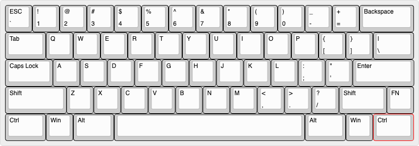
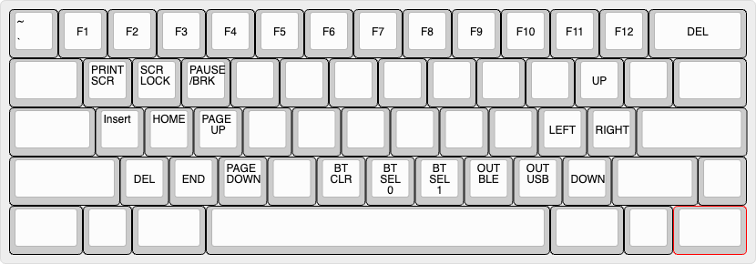

This repository will is a guide on how to cutomize the keymaps for TR60 keyboard, 
build it and download the firmware and flash it to the keyboard.

The default keymaps of TR60 is shown below. (Primary layer and function layer)

If you want to learn more about the hardware please visit [this](https://github.com/hw-tinkerers/TR-60) link.

1. You need to fork this repository to your github account to make any changes.
2. You only need to change the tr60.keymap file to change the keymap for your board to customize keys to your liking.
3. After you have made changes, please commit the changes and the firmware will start building under Actions tab.
4. After the firmware has built, you can download it, unzip and flash it to your board.
5. To flash the firmware, just double press the reset button on the back of the PCB, a drive named TR600 will appear. Just drag and drop the file with .uf2 extension and wait for it to copy.
6. After this just unplug and plug the UCB wire back in and enjoy your customized keymaps. 

Note: There is a default keymap firmware under assets/tr60-zmk.uf2, if you want to flash default keymap again without building the firmware. 